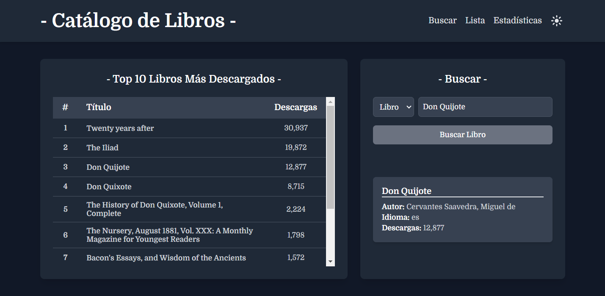
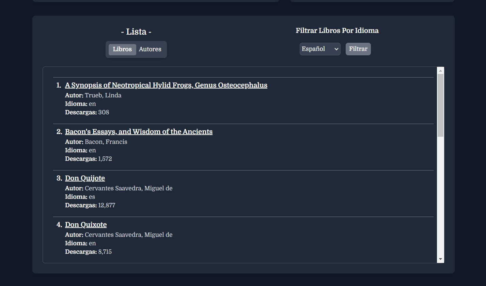
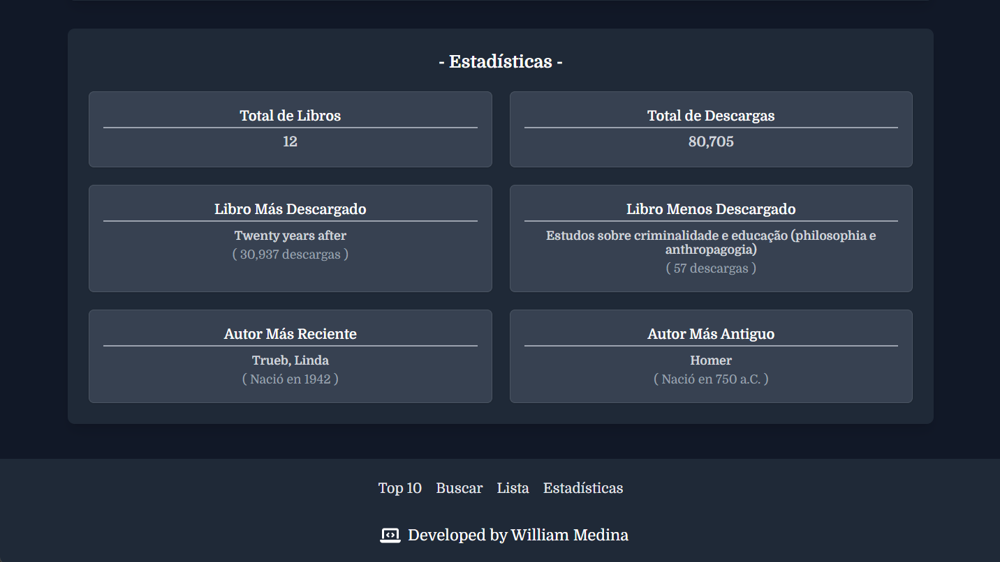
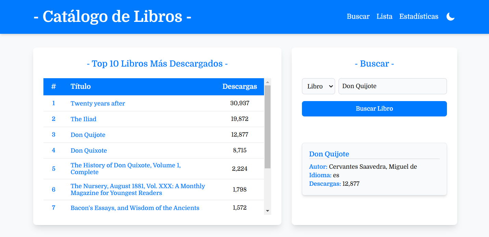
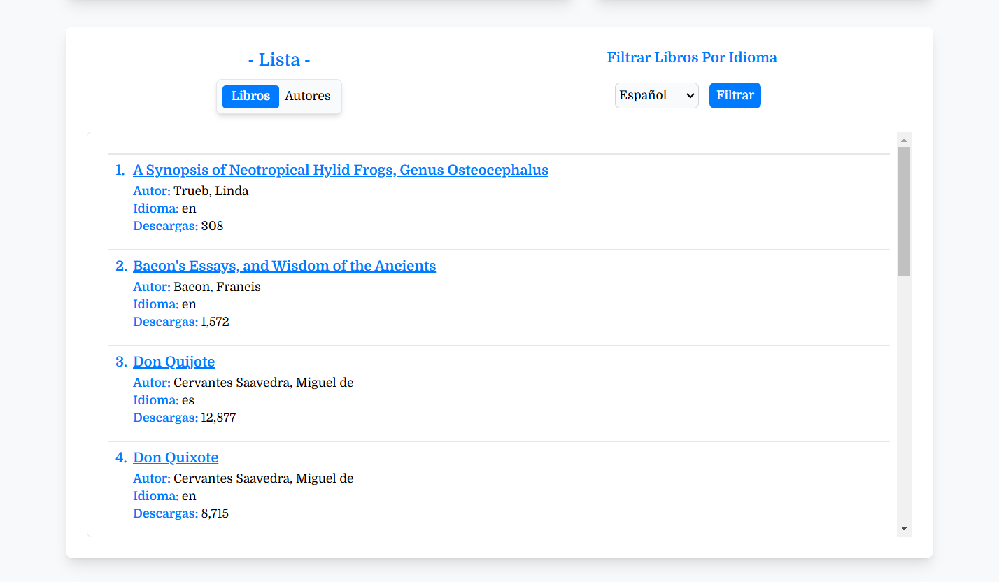
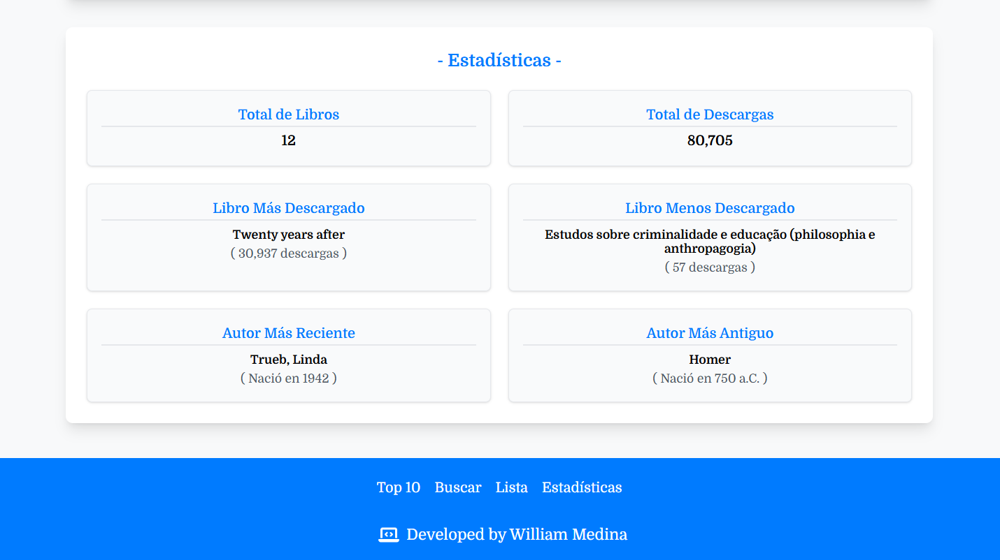

# Catálogo de Libros App


## Índice
1. [Descripción](#descripción)
2. [Características](#características)
3. [Capturas de Pantalla](#capturas-de-pantalla)
4. [Tecnologías Utilizadas](#tecnologías-utilizadas)
5. [Integración con la API](#integración-con-la-api)
6. [Instrucciones](#instrucciones)
7. [Licencia](#licencia)
8. [Autor](#autor)

## Descripción

Catálogo de Libros es una aplicación frontend construida con **React** y **TypeScript**, diseñada para proporcionar una interfaz interactiva y fácil de usar para la gestión y consulta de libros. Esta aplicación permite a los usuarios buscar, visualizar y obtener información detallada sobre libros y autores a través de una integración con una API REST en **Spring Boot** que gestiona los datos en el backend. La aplicación ofrece un diseño moderno y responsivo, utilizando **Tailwind CSS** para estilizar la interfaz y proporcionar una experiencia de usuario atractiva.

## Características

- **Búsqueda**: Permite a los usuarios buscar libros por su título y autores por su nombre.
- **Visualización de Detalles**: Muestra información detallada sobre cada libro, incluidos autores, idiomas y descargas.
- **Filtrado**: Ofrece a los usuarios la capacidad de filtrar libros por idioma y autores según el año de su vida.
- **Modo Oscuro y Claro**: Soporta tanto un tema oscuro como uno claro, mejorando la experiencia del usuario según sus preferencias.
- **Interacción con la API**: Se conecta a una API externa desarrollada en Spring Boot para obtener información sobre libros y autores.
- **Diseño Responsivo**: La aplicación está diseñada para ser accesible y funcional en dispositivos móviles y de escritorio, adaptándose a diferentes tamaños de pantalla.


## Capturas de Pantalla

Aquí hay algunas capturas de pantalla de la App de **Catálogo de Libros**:

### Buscador: Modo Oscuro


### Listas: Modo Oscuro


### Estadísticas: Modo Oscuro


### Buscador: Modo Claro


### Listas: Modo Claro


### Estadísticas: Modo Claro



## Tecnologías Utilizadas

- **React**: Una biblioteca de JavaScript para construir interfaces de usuario.
- **TypeScript**: Un superconjunto tipado de JavaScript que se compila a JavaScript puro.
- **Tailwind CSS**: Un framework CSS basado en utilidades para el desarrollo rápido de interfaces.
- **Vite**: Una herramienta de construcción rápida y un servidor de desarrollo.
- **Axios**: Un cliente HTTP basado en promesas para hacer solicitudes al backend.


## Integración con la API

La App de **Catálogo de Libros** depende de una API externa para obtener datos y manejar las interacciones del usuario. La API es esencial para el correcto funcionamiento de la aplicación.

### Repositorio de la API

La API para el **Catálogo de Libros** se encuentra en un repositorio separado. Puedes encontrarla aquí:

- [Catálogo de Libros API](https://github.com/william-medina/catalogo-libros-api) - Este repositorio contiene la API en Spring Boot.


### Configuración de la API

La aplicación frontend se comunica con la API del backend a través de una variable de entorno. Asegúrate de que la URL base de la API esté configurada correctamente para incluir la ruta `/api`.

- **Variable de Entorno del Frontend**: `VITE_API_URL`

  - El valor de `VITE_API_URL` debe configurarse con la URL base de la API con el endpoint `/api`, por ejemplo: `http://localhost:8080/api`.

Asegúrate de que esta variable apunte al endpoint correcto de la API.

## Instrucciones

Para comenzar con App de **Catálogo de Libros**, sigue estos pasos:

### Requisitos Previos

- [Node.js](https://nodejs.org/) (Se recomienda usar la última versión LTS para mayor estabilidad)
- [NPM](https://www.npmjs.com/) (Node Package Manager)

### Instalación

1. Clona el repositorio:

    ```bash
    git clone https://github.com/william-medina/catalogo-libros-app.git
    ```

2. Navega al directorio del proyecto:

    ```bash
    cd catalogo-libros-app
    ```

3. Instala las dependencias:

    ```bash
    npm install
    ```

4. Configura las variables de entorno:

    Crea un archivo `.env.local` en la raíz de tu directorio del proyecto y añade la siguiente línea:

    ```env
    VITE_API_URL=http://localhost:8080/api
    ```

    Este archivo se usa para configurar ajustes específicos del entorno, como la URL de la API.

### Desarrollo

Para iniciar el servidor de desarrollo, usa el siguiente comando:

```bash
npm run dev
```

### Construcción

Para construir la aplicación para producción, sigue estos pasos:

1. **Ejecuta el Comando de Construcción**

    Ejecuta el siguiente comando para compilar el código TypeScript y empaquetar la aplicación para producción:

    ```bash
    npm run build
    ```

    Este comando hará lo siguiente:

    - Compilará los archivos TypeScript en JavaScript.
    - Empaquetará todos los activos y dependencias usando Vite.
    - Generará los archivos listos para producción en el directorio `dist`.

2. **Despliega la Construcción**

    Una vez que el proceso de construcción esté completo, puedes desplegar el contenido del directorio `dist` en tu servidor de producción. El directorio `dist` contendrá todos los archivos necesarios para servir la aplicación.

3. **Verifica la Construcción**

    Para asegurarte de que todo funcione correctamente, puedes usar el comando de vista previa para probar localmente la construcción de producción antes de desplegar:

    ```bash
    npm run preview
    ```

    Esto servirá la construcción de producción y te permitirá verificar que la aplicación se comporte como se espera.

Siguiendo estos pasos, generarás una versión lista para producción del App de **Catálogo de Libros**.

## Licencia

Este proyecto está bajo la Licencia MIT. Para más detalles, consulta el archivo [LICENSE](./LICENSE).


## Autor

La aplicación de **Catálogo de Libros** es desarrollada y mantenida por:

**William Medina**

¡Gracias por revisar **Catálogo de Libros App**! Puedes encontrarme en [GitHub](https://github.com/william-medina)